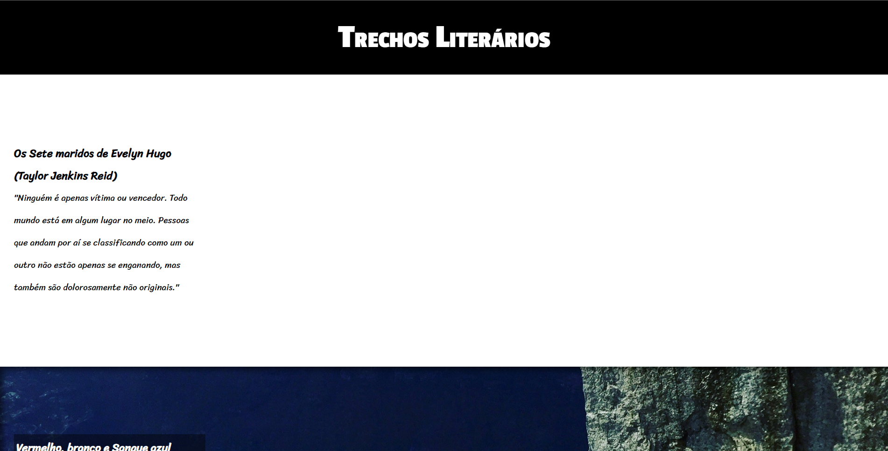

# Projeto: Trechos Literários



## Descrição do Projeto
<p> Baseado no Projeto Cordel desenvolvido no curso de HTML e CSS do Curso em Vídeo durante o capítulo 20. </p>

## 🚀 Tecnologias utilizadas
- ``HTML``
- ``CSS``

## :memo: Licença

Esse projeto está sob a licença MIT.

## 🔗 Link para o site

```
https://rubensgabriel.github.io/projeto-trechos/
```
